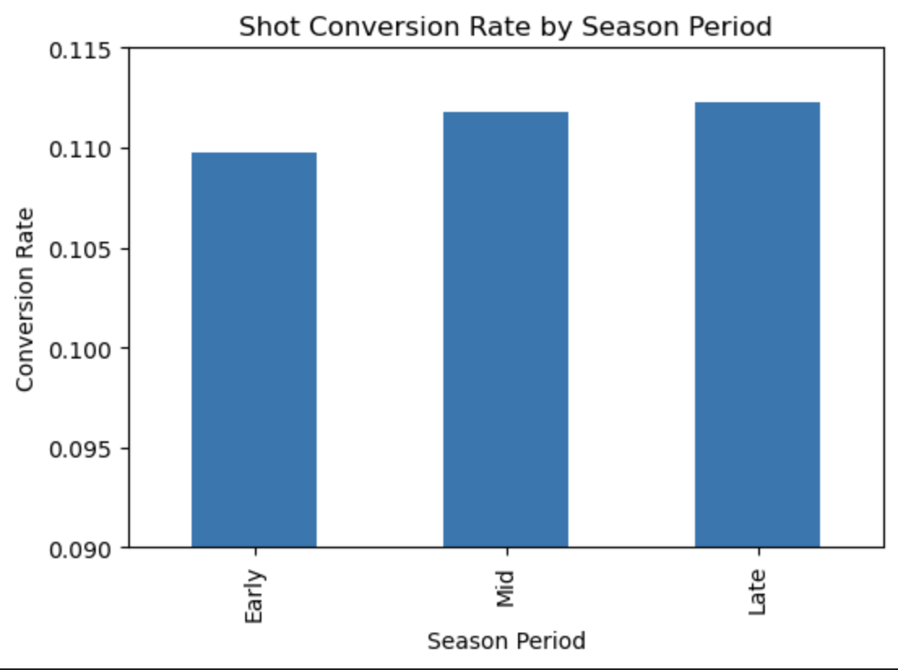

# Milestone 1 Proposal

## Section 1: Motivation and Purpose

### Target Audience

The primary target audience for this dashboard is a team performance analyst or coach in the English Premier League. In this project, we are embodying the role of a data analyst supporting coaching staff with performance insights derived from historical match data. The user is responsible for evaluating tactical effectiveness, identifying performance trends, and making strategic decisions to improve team outcomes.

### Problem

Coaches regularly adjust tactics (e.g., shifting from a defensive to a more attacking style), but evaluating whether these changes truly improve performance is challenging. Match outcomes alone (win/loss/draw) do not fully capture:

- Offensive production (goals scored, shots taken)
- Defensive trade-offs (goals conceded)
- Contextual performance differences (home vs away)
- Performance variation across different phases of the season

Without a structured analytical tool, it is difficult to systematically compare performance before and after tactical adjustments or across different match contexts. Coaches need a way to evaluate whether changes increase scoring efficiency, improve win rate, or introduce unintended weaknesses.

### Solution

This dashboard provides an interactive decisionsupport tool that allows coaches and analysts to:

- Filter matches by season or time period
- Compare performance before and after tactical changes
- Analyze home vs. away performance differences
- Segment performance across early, mid, and late season phases
- Evaluate key performance indicators such as:
   - Win rate
   - Goals scored
   - Goals conceded
   - Shot conversion rate

By enabling structured comparisons across match contexts, the dashboard transforms raw match data into actionable insights. It supports evidence based tactical evaluation, helping coaches determine whether strategic changes improve offensive efficiency, defensive stability, or overall team performance.

## Section 2: Description of the Data

We selected the English Premier League (EPL) Match Data (2000–2025) dataset from Kaggle. The dataset contains historical match level data spanning multiple Premier League seasons between 2000 and 2025.

Number of rows: 9,380 matches
Number of columns: 22 variables

Each row represents a single match and includes key information such as the home team, away team, goals scored by each team, shots taken, match result, season, and match date. The dataset provides both offensive and defensive performance indicators at the match level.

### Relevance to the Problem

The dataset directly supports our objective of evaluating tactical effectiveness and team performance. 
- Goals scored and goals conceded allow us to measure offensive production and defensive stability, helping assess trade-offs after tactical changes.
- Shots taken enable calculation of shot conversion rate, which measures scoring efficiency. 
- Match results allow computation of win rate, a key indicator of overall performance. - Season and date variables allow us to segment matches into early, mid, and late season phases and compare performance before and after tactical adjustments. 
- Home vs. away match indicators support analysis of venue based performance differences. 

Because the dataset includes detailed match level statistics across multiple seasons, it enables structured comparisons across time periods, venues, and tactical phases. This makes it well suited for building an interactive dashboard that supports evidence based decision making for coaches and performance analysts.

## Section 3: Research Questions & Usage Scenario

### Persona

The primary user of this dashboard is a team performance analyst or coach in the English Premier League. The coach aims to evaluate team performance using historical match data to identify strengths, weaknesses, and areas for improvement. In particular, they are interested in improving overall performance and analyzing scoring efficiency across different match contexts.

### Usage Scenario

A coach is reviewing team performance after switching tactics from a defensive approach to a more attacking style. They want to compare match outcomes and performance indicators before and after the tactical shift to understand whether the change led to increased offensive production (e.g., higher shots and goals) and whether it introduced trade-offs such as conceding more goals. The dashboard allows them to filter matches by season or time period and compare key metrics across these phases.

### User Stories

#### User Story 1
As a coach/team analyst, I want to compare goals scored and shots taken before and after switching from a defensive to an attacking approach so that I can evaluate whether the tactical change improved offensive performance or contributed to a decline in results.

#### User Story 2
As a coach/team analyst, I want to compare win rate, goals scored, and goals conceded in home versus away matches so that I can understand whether our performance significantly differs by venue and adjust match strategies accordingly.

#### User Story 3
As a coach/team analyst, I want to compare win rate and goals scored across early, mid, and late season periods so that I can identify when the team performs best and adjust training intensity or tactical planning accordingly.

## Section 4: Exploratory Data Analysis
To evaluate seasonal performance variation, we analyzed win rate, average goals per match, and shot conversion rate across early, mid, and late season periods. While win rate and goals showed minimal variation, shot conversion rate revealed a slight increase in efficiency toward the late season. This supports the user story by demonstrating how performance metrics can be segmented across season phases to assess tactical effectiveness.

Below is a project-ready **Section 5** that you can directly integrate into your milestone document.

# Section 5: Dashboard Interface & Interaction Design

## 5.1 Overview of the Interface

The dashboard is designed as an interactive decision-support tool that provides both performance summaries and detailed contextual analysis. The layout follows a structured hierarchy:

1. **Top Row:** Key performance indicators (KPIs) for quick assessment
2. **Left Sidebar:** Interactive filters for contextual segmentation
3. **Main Panel:** Visualizations for comparative and trend analysis

This structure ensures that users can first gain a quick understanding of overall team performance and then drill down into specific contexts such as season phase, venue or period.

## 5.2 Landing Page 

When the dashboard loads, it presents an aggregated overview of team performance across the full dataset. This view allows coaches to quickly assess overall effectiveness before applying filters.

### Key Performance Indicators (KPI Cards)

The top section contains five summary metrics:

* **Total Matches** – Total number of matches included in the current selection
* **Average Win Rate** – Percentage of matches won
* **Average Goals Scored** – Mean goals scored per match
* **Average Goals Conceded** – Mean goals allowed per match
* **Average Shot Conversion Rate** – Percentage of shots converted into goals

#### Design Purpose

The KPI cards function as an executive summary. Coaches can immediately assess:

* Overall performance stability
* Offensive output
* Defensive vulnerability
* Scoring efficiency

#### Interaction Behavior

* All KPI values update dynamically when filters are applied.
* Metrics reflect only the currently selected subset of matches.
* This enables instant before and after comparisons when evaluating changes.

## 5.3 Filter Panel 

The left sidebar contains interactive dropdown filters that allow users to segment the data by match context.

### Available Filters

* **Season** – Select a specific EPL season
* **Season Period** – Early, mid or late season segmentation
* **Team** – Select a specific team
* **Match Venue** – Home or away matches
* **Match Phase** – Allows segmentation of matches by contextual grouping (e.g., before vs after tactical shift)

### Design Purpose

The filter panel enables structured performance comparisons across different conditions. This directly supports the user stories by allowing coaches to:

* Compare performance before and after tactical adjustments
* Evaluate home versus away differences
* Analyze early, mid, and late season trends
* Focus on specific seasons for longitudinal analysis

## 5.4 Visualization Components

The central panel contains three core visualizations 

### 5.4.1 Win Rate by Season Period (Bar Chart)

This chart displays win rate across early, mid and late season phases.

#### Analytical Purpose

* Identifies performance fluctuations across the season
* Detects peak performance periods
* Supports training and tactical planning decisions

### 5.4.2 Shot Conversion Rate by Season Period (Bar Chart)

This visualization shows scoring efficiency across season periods.

#### Analytical Purpose

* Evaluates offensive efficiency independent of total shot volume
* Identifies whether tactical shifts improve shot quality
* Highlights finishing consistency

### 5.4.3 Goals Scored vs. Goals Conceded (Trend Line Chart)

This chart compares offensive and defensive output across time or selected grouping.

#### Analytical Purpose

* Visualizes trade-offs between attacking intensity and defensive stability
* Identifies whether increased scoring corresponds with increased conceding
* Supports risk–reward tactical evaluation

