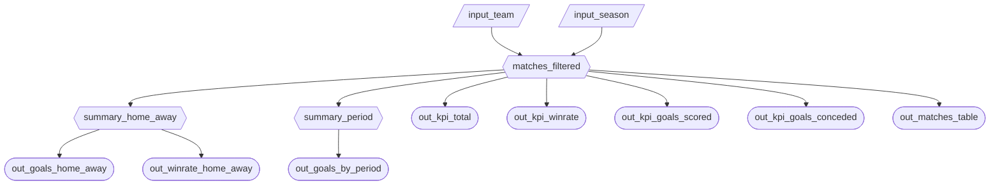

# Milestone 2 App Specification

## 2.1 Updated Job Stories

| \# | Job Story | Status | Notes |
|----|----|----|----|
| 1 | When I select a **team** and **season**, I want to see **average goals scored vs average goals conceded** across **Home and Away** matches, so I can tell whether the team performs better offensively or defensively depending on venue. | Revised | **Changed from:** comparing goals scored and shots taken before and after a tactical shift using two user-defined date windows. **Reason:** the original story required 4 date pickers and was fragile — many teams have very few matches per season, so user-picked windows frequently returned 0 results and made the chart meaningless. There is also no column marking when a tactical shift occurred, making the "before/after" framing arbitrary. **Changed to:** a Home vs Away grouped bar chart comparing avg goals scored vs conceded. This always has data as long as the team played that season, requires no extra inputs beyond team and season, and answers a clearer tactical question about venue-based offensive vs defensive output. |
| 2 | When I select a **team** and **season**, I want to see the **win rate** for **Home vs Away** matches, so I can tell whether the team wins more often at home or away. | Revised | **Changed from:** comparing win rate, average goals scored, and average goals conceded all together in a single Home vs Away chart. **Reason:** showing three metrics at once in one chart made it visually cluttered and harder to read, especially with small match counts per venue. Each metric competed for attention and the chart became a grouped bar with too many bars. **Changed to:** a single focused bar chart with just two bars — Home win rate % and Away win rate %. One question, one chart. Win is calculated from the selected team's perspective: win = FullTimeResult "H" when the team is HomeTeam, "A" when the team is AwayTeam. |
| 3 | When I select a **team** and **season**, I want to see how **average goals scored** changes across **Early, Mid, and Late** season periods, so I can tell whether the team's attack improves or fades as the season progresses. | Revised | **Changed from:** comparing both win rate and average goals scored across Early/Mid/Late on a dual-axis line chart. **Reason:** a dual y-axis chart with two metrics is difficult to interpret — the two scales are independent so visual comparisons between lines are misleading. It also tried to answer two questions at once. **Changed to:** a single-axis line chart showing only avg goals scored across the three periods. Period definition is deterministic: sort the selected team+season's matches by MatchDate and split into 3 equal-sized groups (Early / Mid / Late), so results are consistent regardless of team or season chosen. |

------------------------------------------------------------------------

## 2.2 Component Inventory

| ID | Type | Shiny widget / renderer | Depends on | Job story |
|----|----|----|----|----|
| `input_team` | Input | `ui.input_select()` | — | #1, #2, #3 |
| `input_season` | Input | `ui.input_select()` | — | #1, #2, #3 |
| `matches_filtered` | Reactive calc | `@reactive.calc` | `input_team`, `input_season` | #1, #2, #3 |
| `summary_home_away` | Reactive calc | `@reactive.calc` | `matches_filtered` | #1, #2 |
| `summary_period` | Reactive calc | `@reactive.calc` | `matches_filtered` | #3 |
| `out_kpi_total` | Output | `@render.ui` | `matches_filtered` | #1, #2, #3 |
| `out_kpi_winrate` | Output | `@render.ui` | `matches_filtered` | #2 |
| `out_kpi_goals_scored` | Output | `@render.ui` | `matches_filtered` | #1 |
| `out_kpi_goals_conceded` | Output | `@render.ui` | `matches_filtered` | #1 |
| `out_goals_home_away` | Output | `@render.plot` | `summary_home_away` | #1 |
| `out_winrate_home_away` | Output | `@render.plot` | `summary_home_away` | #2 |
| `out_goals_by_period` | Output | `@render.plot` | `summary_period` | #3 |
| `out_matches_table` | Output | `@render.data_frame` | `matches_filtered` | #1, #2, #3 |

## Complexity Enhancement

To improve robustness and user experience we implemented a server-side reset flow using Shiny's reactivity primitives:

- Added a `@reactive.event(input.btn_reset)` reactive (`_reset_event`) which is triggered exactly once per reset button click.
- Added a `@reactive.effect` (`_do_reset`) that depends on `_reset_event` and performs the side-effect of restoring canonical defaults (`input_team` → `Arsenal`, `input_season` → `2000/01`, `input_result` → `All`) via `session.set_input_value`.

Why this improves UX:
- Single-run calculation: `@reactive.event` ensures a single trigger per click, avoiding repeated recalculation across multiple outputs and making resets efficient.
- Centralized side-effect: the `@reactive.effect` performs all input restores in one place, guaranteeing that all widgets are reset together and that downstream reactives recompute from the same canonical state.
- Deterministic behavior: server-side reset avoids timing issues or race conditions that can occur when resetting many widgets via client-side JS alone, ensuring KPIs, charts and tables update reliably after a reset.

Implementation note: the server uses `session.set_input_value(...)` to programmatically set inputs; this approach integrates with Shiny's reactive engine so each input change triggers reactives exactly once and feeds all dependent outputs.
## 2.3 Reactive Diagram

## 2.4 Calculation Details

### matches_filtered
- **Depends on:** `input_team`, `input_season`
- **What it does:** Filters the full match dataset to only include matches where the selected team participated in the selected season (either as HomeTeam or AwayTeam).
- **Used by:** `summary_home_away`, `summary_period`, all KPI outputs, and the matches table.

---

### summary_home_away
- **Depends on:** `matches_filtered`
- **What it does:** Aggregates filtered matches to compute Home vs Away metrics from the selected team's perspective, including:
  - average goals scored  
  - average goals conceded  
  - win rate  
- **Used by:** `out_goals_home_away`, `out_winrate_home_away`

---

### summary_period
- **Depends on:** `matches_filtered`
- **What it does:** Sorts matches by MatchDate and splits them into Early, Mid, and Late season periods (equal-sized groups), then computes average goals scored per period.
- **Used by:** `out_goals_by_period`
