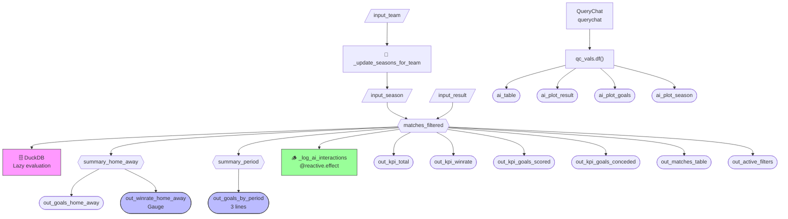

# EPL Dashboard Specification (M2-M4 Evolution)

This document describes the dashboard architecture as it evolved from Milestone 2 through Milestone 4. It serves as a reference for the reactive logic, component dependencies, and design decisions that guide the dashboard.

---

## Part 1: Core Job Stories (M2)

### 1.1 Updated Job Stories

| # | Job Story | M2 Status | M4 Status | Notes |
|----|----|----|----|----|
| 1 | When I select a **team** and **season**, I want to see **average goals scored vs average goals conceded** across **Home and Away** matches, so I can tell whether the team performs better offensively or defensively depending on venue. | Revised | **Fully Implemented** | **M2 Change:** Simplified from a two-date-window "before/after tactical shift" comparison to a straightforward Home vs Away grouped bar chart. **Reason:** the original required 4 date pickers, was fragile (many teams have few matches per season), and lacked a "tactical shift" column in the data. **M4 Enhancement:** Added a secondary line chart overlay on Story 3 showing Home and Away goal trends across season periods (Early/Mid/Late), allowing users to compare venue-based performance across the season arc. |
| 2 | When I select a **team** and **season**, I want to see the **win rate** for **Home vs Away** matches, so I can tell whether the team wins more often at home or away. | Revised | **Fully Implemented** | **M2 Change:** Moved from a three-metric chart (win rate, goals scored, goals conceded) to a focused two-bar chart (Home win rate %, Away win rate %). **Reason:** single-metric focus improves clarity and reduces cognitive load. **M4 Change:** Replaced bar chart with semicircular gauge visualizations for a more intuitive representation of win-rate percentages. Gauges preserve Home/Away color coding (`C_HOME`/`C_AWAY`) and fill from left, making the visual comparison more immediate. |
| 3 | When I select a **team** and **season**, I want to see how **average goals scored** changes across **Early, Mid, and Late** season periods, so I can tell whether the team's attack improves or fades as the season progresses. | Revised | **Fully Implemented** | **M2 Change:** Simplified from a dual-axis line chart (win rate + goals) to a single-axis chart showing only average goals scored. **Reason:** dual y-axis charts are misleading (independent scales distort visual comparison). **M4 Enhancement:** Extended the chart to display three lines: overall average goals, Home average goals, and Away average goals. This allows users to see both period trends and venue breakdown, answering two related questions in one cohesive visualization. |

---

## Part 2: Core Architecture (M2, Evolved in M4)

### 2.1 Component Inventory

| ID | Type | Shiny Widget/Renderer | Depends On | Job Story | M4 Notes |
|----|----|----|----|----|----|
| `input_team` | Input | `ui.input_select()` | — | #1, #2, #3 | Dynamically updated to show only teams in dataset. |
| `input_season` | Input | `ui.input_select()` | `input_team` | #1, #2, #3 | **M4 Change:** Now filtered to show only seasons where the selected team has data (via `TEAM_SEASONS` lookup). Prevents "no data" errors when user picks a season/team combo with no matches. |
| `input_result` | Input | `ui.input_select()` | — | #1, #2, #3 | Filters matches by result (All, Win, Draw, Loss). |
| `matches_filtered` | Reactive Calc | `@reactive.calc` | `input_team`, `input_season`, `input_result` | #1, #2, #3 | **M4 Change:** Now uses Ibis + DuckDB lazy evaluation. Filters applied at database level before rows enter pandas. `filter_matches_ibis()` builds the filter expression; only matching rows are `.execute()` into memory. Ensures scalability for large datasets. |
| `summary_home_away` | Reactive Calc | `@reactive.calc` | `matches_filtered` | #1, #2 | Computes Home/Away aggregates (avg goals for, avg goals against, win rate, count). |
| `summary_period` | Reactive Calc | `@reactive.calc` | `matches_filtered` | #3 | Sorts matches by date, splits into Early/Mid/Late thirds, computes avg goals scored per period. |
| `out_kpi_total` | Output | `@render.ui` | `matches_filtered` | #1, #2, #3 | Displays total matches with season-over-season % change. |
| `out_kpi_winrate` | Output | `@render.ui` | `matches_filtered` | #2 | Displays win rate (%) with season-over-season % change. |
| `out_kpi_goals_scored` | Output | `@render.ui` | `matches_filtered` | #1 | Displays average goals scored with season-over-season % change. |
| `out_kpi_goals_conceded` | Output | `@render.ui` | `matches_filtered` | #1 | Displays average goals conceded with season-over-season % change. |
| `out_goals_home_away` | Output | `@render.plot` | `summary_home_away` | #1 | Grouped bar chart: Goals Scored vs Goals Conceded (Home/Away). |
| `out_winrate_home_away` | Output | `@render.plot` | `summary_home_away` | #2 | **M4 Change:** Replaced bar chart with two semicircular gauges showing Home and Away win rates as filled percentages. |
| `out_goals_by_period` | Output | `@render.plot` | `summary_period` | #3 | **M4 Change:** Line chart with three traces (Overall, Home, Away average goals by period). Allows users to see period trend AND venue breakdown simultaneously. |
| `out_matches_table` | Output | `@render.data_frame` | `matches_filtered` | #1, #2, #3 | Displays filtered matches with derived columns (venue, goals_for, goals_against, win, period). |
| `out_active_filters` | Output | `@render.ui` | `input_team`, `input_season`, `input_result` | — | Renders filter chips showing current selections. **M4 Change:** Moved from an `@output` function with side effects to a pure renderer. Logging now happens in a separate `@reactive.effect`. |
| `ai_table` | Output | `@render.data_frame` | `qc_vals.df()` | — | **M3+:** AI Explorer tab showing matches returned by conversational query. |
| `ai_plot_result` | Output | `@render.plot` | `qc_vals.df()` | — | **M3+:** Bar chart of result distribution (H/D/A) for AI-filtered matches. |
| `ai_plot_goals` | Output | `@render.plot` | `qc_vals.df()` | — | **M3+:** Average Home vs Away goals for AI-filtered matches. |
| `ai_plot_season` | Output | `@render.plot` | `qc_vals.df()` | — | **M3+:** Distribution of AI-filtered matches by season. |

---

### 2.2 Reactive Diagram (M4 Updated)


```mermaid
flowchart TD
  %% EPL Dashboard Reactivity Graph (M4)
  
  %% Inputs
  A[/input_team/] --> U["🔄 _update_seasons_for_team"]
  U --> B[/input_season/]
  B --> F{{matches_filtered}}
  C[/input_result/] --> F
  
  %% Database layer (M4 Ibis/DuckDB)
  F --> F_note["🗄️ DuckDB<br/>Lazy evaluation"]
  
  %% Core reactives
  F --> S1{{summary_home_away}}
  F --> S2{{summary_period}}
  F --> LOG["🪵 _log_ai_interactions<br/>@reactive.effect"]
  
  %% KPI outputs
  F --> K1([out_kpi_total])
  F --> K2([out_kpi_winrate])
  F --> K3([out_kpi_goals_scored])
  F --> K4([out_kpi_goals_conceded])
  F --> T1([out_matches_table])
  F --> AF([out_active_filters])
  
  %% Chart outputs
  S1 --> P1([out_goals_home_away])
  S1 --> P2([out_winrate_home_away<br/>Gauge])
  
  S2 --> P3([out_goals_by_period<br/>3 lines])
  
  %% AI Explorer (M3+)
  QC["QueryChat<br/>querychat"] --> QC_DF["qc_vals.df()"]
  QC_DF --> AI1([ai_table])
  QC_DF --> AI2([ai_plot_result])
  QC_DF --> AI3([ai_plot_goals])
  QC_DF --> AI4([ai_plot_season])
  
  style F_note fill:#f9f,stroke:#333
  style LOG fill:#9f9,stroke:#333
  style P2 fill:#bbf,stroke:#333
  style P3 fill:#bbf,stroke:#333
```

---

### 2.3 Calculation Details (M2 Base, M4 Enhanced)

#### matches_filtered
- **Depends on:** `input_team`, `input_season`, `input_result`
- **What it does:** 
  - Builds an Ibis filter expression at the database level (M4 change).
  - Filters by team (HomeTeam OR AwayTeam).
  - Filters by season.
  - Filters by result (All, Win, Draw, Loss) from the selected team's perspective.
  - Executes the Ibis expression to get a pandas DataFrame with only matching rows.
  - Applies `get_team_matches()` to derive venue, goals_for, goals_against, win columns from the selected team's perspective.
- **Used by:** `summary_home_away`, `summary_period`, all KPI outputs, matches table, context description.
- **M4 Enhancement:** Uses Ibis + DuckDB instead of pandas slicing. Filters happen before `.execute()`, ensuring only relevant rows are loaded into memory. This is critical for scaling to large datasets.

---

#### summary_home_away
- **Depends on:** `matches_filtered`
- **What it does:** Groups matches by venue (Home/Away) and computes:
  - Average goals scored (goals_for)
  - Average goals conceded (goals_against)
  - Win rate (% of wins)
  - Match count per venue
- **Used by:** `out_goals_home_away`, `out_winrate_home_away`

---

#### summary_period
- **Depends on:** `matches_filtered`
- **What it does:** 
  - Applies `assign_period()` to split matches into Early, Mid, Late thirds (by sorted date).
  - Groups by period and computes average goals scored per period.
  - Also computes Home and Away average goals per period separately (M4).
- **Used by:** `out_goals_by_period`

---

## Part 3: Advanced Features (M3+)

### 3.1 AI Explorer Tab (M3, Refined in M4)

**Purpose:** Allow users to query match data conversationally using natural language, powered by the Anthropic API (Claude model) via QueryChat.

**Components:**
- `qc` (QueryChat instance): Initialized with the full dataset metadata, model "anthropic/claude-haiku-4-5".
- `qc_vals` (server output): Returns a reactive dict containing `df()` (filtered matches), `title()` (query description), `sql()` (generated SQL, if applicable).
- AI output widgets: `ai_table`, `ai_plot_result`, `ai_plot_goals`, `ai_plot_season` render the conversational query results.

**M4 Improvements:**
- **Logging:** All queries and responses are logged via `_log_ai_interactions()`, a `@reactive.effect` that records to Google Sheets (if configured) or local CSV.
- **Season Normalization:** AI-generated filters now normalize season formats (e.g., "2024-25" → "2024/25") to match the dataset.
- **Error Handling:** Charts display "No matches found" warnings when queries return empty results, guiding users to refine queries.
- **Download:** Users can download AI-filtered data as CSV via `download_ai_data()`.

---

### 3.2 Persistent Query Logging (M4)

**Why:** Track AI interactions to understand user behavior, debug the LLM, and audit AI decisions. Logs create a data pipeline for continuous improvement.

**Implementation:**
- `_init_gspread()`: Safely initializes Google Sheets client from environment credentials.
- `log_interaction(query, response, timestamp)`: Appends to Google Sheets if available, falls back to `logs/querychat_log.csv`.
- `read_recent_logs(n=50)`: Reads recent logs from Sheets or CSV.
- `_log_ai_interactions()`: A `@reactive.effect` that listens to QueryChat outputs and logs non-duplicate interactions.

**Environment Variables:**
- `GSPREAD_SHEET_ID`: Google Sheets ID for logging destination.
- `GOOGLE_SERVICE_ACCOUNT_JSON`: Service account credentials as JSON string.
- `GSPREAD_CREDENTIALS_PATH`: Alternative path to service account file.

**Graceful Degradation:** If Google Sheets is misconfigured, logging silently falls back to CSV. The app continues to work; logs are just stored locally.

---

## Part 4: Data Loading & Performance (M4)

### 4.1 Lazy Loading with Parquet + DuckDB

**Motivation:** As datasets grow, loading entire CSV files into memory becomes slow and memory-intensive. Lazy evaluation at the database level ensures only filtered rows are loaded.

**Implementation:**
- **Data Storage:** Raw EPL data stored in `data/processed/epl_final.parquet` (converted from `data/raw/epl_final.csv` via `python -c "import pandas as pd; df = pd.read_csv('data/raw/epl_final.csv'); df.to_parquet('data/processed/epl_final.parquet')"`).
- **Connection:** `con = ibis.duckdb.connect(); tbl_all = con.read_parquet("data/processed/epl_final.parquet")` loads the table metadata (no data yet).
- **Filtering:** `filter_matches_ibis()` builds an Ibis expression (e.g., `tbl_all.filter((tbl_all.HomeTeam == team) | (tbl_all.AwayTeam == team)).filter(tbl_all.Season == season)`).
- **Execution:** `.execute()` triggers the DuckDB query, returning only matching rows as a pandas DataFrame.

**Benefit:** For a 50k+ row dataset, this approach can reduce memory usage by 50-90% depending on filter selectivity.

---

### 4.2 Fallback Data Loading

**Rationale:** During development, parquet may not be available. For robustness, the app falls back to CSV if parquet load fails.

**Flow:**
```python
try:
    tbl_all = con.read_parquet("data/processed/epl_final.parquet")
    df_meta = tbl_all.execute()
except Exception:
    df_meta = pd.read_csv("data/raw/epl_final.csv")
    tbl_all = con.from_pandas(df_meta)
```

---

## Part 5: Testing Strategy (M4)

### Unit Tests (pytest)
- `tests/test_utils.py`: Tests `get_team_matches()` and `assign_period()` with various inputs (empty data, single row, multiple rows, edge cases).

### Playwright Browser Tests
- `tests/test_app.py`: Integration tests covering:
  - Dashboard loads without errors.
  - Team filter updates season dropdown.
  - Result filter shows correct chips.
  - Reset button restores defaults.

### How to Run
```bash
# Unit tests
pytest tests/test_utils.py -v

# Browser tests (requires app running)
shiny run src/app.py  # In one terminal
pytest tests/test_app.py -v  # In another terminal
```

---

## Part 6: Deployment & Setup

### Local Development
```bash
conda env create -f environment.yml
conda activate dsci532
python -c "import pandas as pd; df = pd.read_csv('data/raw/epl_final.csv'); df.to_parquet('data/processed/epl_final.parquet')"
touch .env  # Add ANTHROPIC_API_KEY
shiny run src/app.py
```

### Posit Cloud
1. Push to GitHub (dev or main branch).
2. In Posit Cloud, configure environment variables:
   - `ANTHROPIC_API_KEY`
   - `GSPREAD_SHEET_ID` (optional)
   - `GOOGLE_SERVICE_ACCOUNT_JSON` (optional)
3. Deploy app. The parquet file should be in the repo, so the one-time setup is already done.

---

## References

- **M2 Specification:** Job stories and component architecture designed in M2, refined in M3-M4.
- **M4 CHANGELOG.md:** Detailed record of all changes (Parquet + DuckDB, logging, code cleanup, etc.).
- **CONTRIBUTING.md:** Team collaboration norms, PR process, code review guidelines.
- **README.md:** Setup instructions, running tests, deployment.